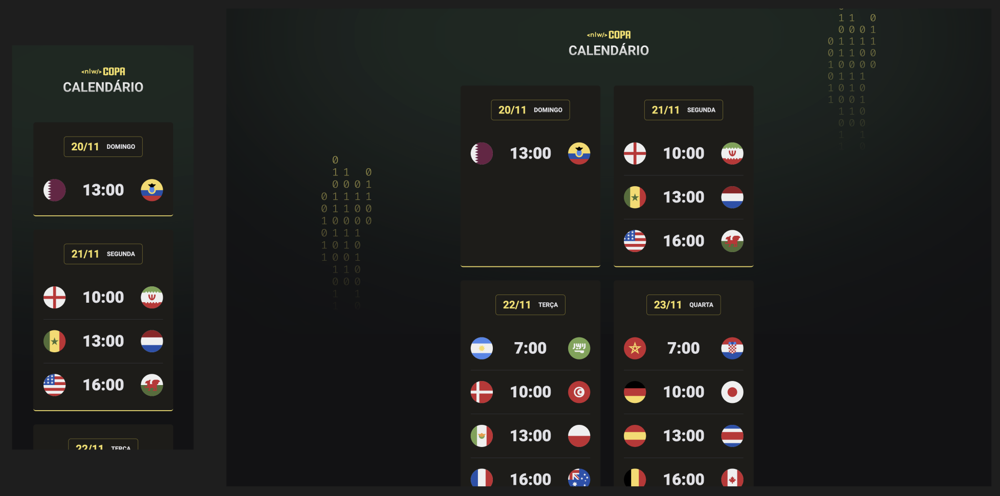

<h1 align="center">NLW #10 - 2022 World Cupp</h1>

WEB project developed at Rocketseat's NLW #10 event.

  <a href="#-technologies">Technology</a>&nbsp;&nbsp;&nbsp;|&nbsp;&nbsp;&nbsp;
  <a href="#-Project">Project</a>&nbsp;&nbsp;&nbsp;|&nbsp;&nbsp;&nbsp;
  <a href="#-layout">Layout</a>&nbsp;&nbsp;&nbsp;|&nbsp;&nbsp;&nbsp;
  <a href="#memo-license">License</a>

  

 

  

## 🚀 Technologies

This project was developed with the following technologies:

- HTML and CSS
- JavaScript
- Git and Github

## 💻 Project

The World Cup calendar is a project that shows the matches of the 2022 World Cup.

## 🔖 Layout

You can view the layout of the project through <a href="https://www.figma.com/file/LIJGN9a8GoV2FAhCKeK3UJ/Calend%C3%A1rio-de-Jogos" target="_blank">THIS LINK</a>. You need an account on <a href="https://figma.com" target="_blank">Figma</a> to access it.

## :memo: License

This project is under the MIT license.

